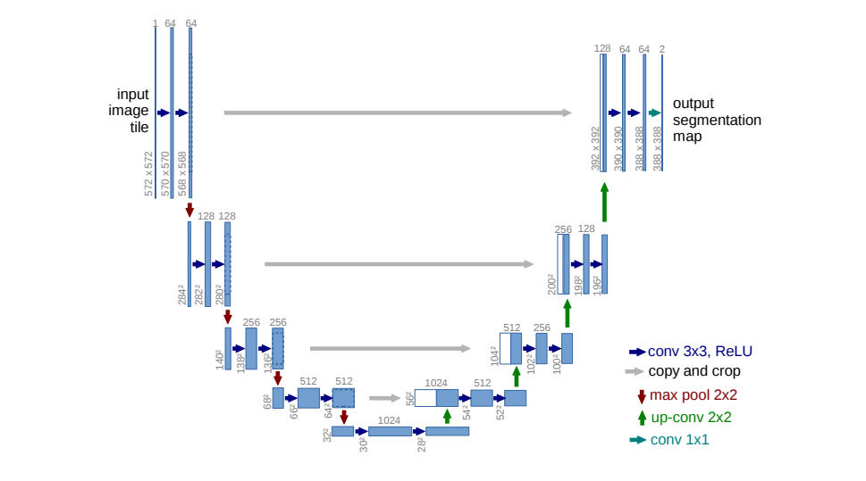

# Image Segmentation with U-Net
A modular, clean PyTorch implementation of the classic **U-Net** architecture for semantic image segmentation, trained on the Oxford-IIIT Pet dataset for binary foreground/background pet segmentation.

---

## Architecture Overview

The U-Net architecture follows an encoder-decoder "U"-shaped structure comprising a contracting path (encoder), a bottleneck, and an expanding path (decoder), linked via long skip connections that preserve high-resolution spatial details.

<p align="center">
  <br/>
  <em>Figure 1: U-Net Architecture (From Ronneberger et al., 2015) as example.</em>
  <a href="https://arxiv.org/pdf/1505.04597">Origional Paper</a>
</p>


### Architectural Components

The model is modularized into distinct building blocks across dedicated files:

1. Double Convolution Block (`double_conv.py`)

2. Contracting / Encoder Block (`encoder.py`)

3. Bottleneck (`model.py`)

4. Expanding / Decoder Block (`decoder.py`)

5. Output Head (`model.py`)

---

## Detailed Tensor Dimension Progression

Assuming a standard batch input of shape `[B, 3, 256, 256]`:

| Stage | Sub-module | Input Shape | Output Shape | Notes |
|---|---|---|---|---|
| **Input** | - | - | `(B, 3, 256, 256)` | Normalized RGB batch |
| **Encoder 1** | `EncoderBlock(3, 64)` | `(B, 3, 256, 256)` | `out: (B, 64, 128, 128)`<br>`skip1: (B, 64, 256, 256)` | Pool reduces resolution by $2\times$ |
| **Encoder 2** | `EncoderBlock(64, 128)` | `(B, 64, 128, 128)` | `out: (B, 128, 64, 64)`<br>`skip2: (B, 128, 128, 128)` | Feature channels double |
| **Encoder 3** | `EncoderBlock(128, 256)` | `(B, 128, 64, 64)` | `out: (B, 256, 32, 32)`<br>`skip3: (B, 256, 64, 64)` | Spatial dimension: $64\times64$ |
| **Encoder 4** | `EncoderBlock(256, 512)` | `(B, 256, 32, 32)` | `out: (B, 512, 16, 16)`<br>`skip4: (B, 512, 32, 32)` | Spatial dimension: $32\times32$ |
| **Bottleneck** | `DoubleConv(512, 1024)` | `(B, 512, 16, 16)` | `(B, 1024, 16, 16)` | Deepest layer |
| **Decoder 4** | `DecoderBlock(1024, 512)` | `x: (B, 1024, 16, 16)`<br>`skip4: (B, 512, 32, 32)` | `(B, 512, 32, 32)` | Up: $32\times32$ (512 ch) + skip (512 ch) -> Cat 1024 ch -> Conv 512 ch |
| **Decoder 3** | `DecoderBlock(512, 256)` | `x: (B, 512, 32, 32)`<br>`skip3: (B, 256, 64, 64)` | `(B, 256, 64, 64)` | Up: $64\times64$ (256 ch) + skip (256 ch) -> Cat 512 ch -> Conv 256 ch |
| **Decoder 2** | `DecoderBlock(256, 128)` | `x: (B, 256, 64, 64)`<br>`skip2: (B, 128, 128, 128)` | `(B, 128, 128, 128)` | Up: $128\times128$ (128 ch) + skip (128 ch) -> Cat 256 ch -> Conv 128 ch |
| **Decoder 1** | `DecoderBlock(128, 64)` | `x: (B, 128, 128, 128)`<br>`skip1: (B, 64, 256, 256)` | `(B, 64, 256, 256)` | Up: $256\times256$ (64 ch) + skip (64 ch) -> Cat 128 ch -> Conv 64 ch |
| **Final Conv**| `Conv2d(64, 1, 1)` | `(B, 64, 256, 256)` | `(B, 1, 256, 256)` | Raw output logits |

---

## Dataset & Training Pipeline

### Dataset (`dataset.py`)
- **Dataset**: [Oxford-IIIT Pet Dataset](https://www.robots.ox.ac.uk/~vgg/data/pets/) (`torchvision.datasets.OxfordIIITPet`).
- **Input Resolution**: Resized to $256\times256$ pixels (Bilinear for RGB image, Nearest Neighbor for segmentation mask).
- **Mask Binarization**: Original trimap classes $\{1: \text{Pet}, 2: \text{Background}, 3: \text{Border}\}$ are converted to a binary target:
  $$\text{Mask}(i, j) = \begin{cases} 1.0 & \text{if trimap} = 1 \\ 0.0 & \text{otherwise} \end{cases}$$
- **Output Tensor Shapes**:
  - Image: `torch.FloatTensor` of shape `[3, 256, 256]` scaled to $[0.0, 1.0]$.
  - Mask: `torch.FloatTensor` of shape `[1, 256, 256]` with values in $\{0.0, 1.0\}$.

### Training Configuration (`config.py` & `train.py`)
- **Loss Function**: `nn.BCEWithLogitsLoss()` (combines Sigmoid layer and binary cross-entropy for numerical stability).
- **Optimizer**: `torch.optim.Adam` with learning rate $\eta = 10^{-4}$.
- **Batch Size**: 16.
- **Epochs**: 5.
- **Train/Val Split**: 80% train / 20% validation (reproducible seed 42).
- **Multi-Environment Support**: Easily switchable paths in `config.py` for Local, Google Colab (with Google Drive persistence), and Kaggle.
- **Checkpointing & Recovery**:
  - `last_checkpoint.pth`: Full state dictionary (model, optimizer, epoch, losses) saved every epoch for crash/disconnection recovery.
  - `best_model.pth`: Saved whenever validation loss improves.
  - `unet_pet_segmentation_final.pth`: Clean weights-only model state saved upon training completion.

---

## Repository Structure

```
├── .gitignore         # Ignores large datasets (data/), checkpoints, virtualenvs, caches
├── requirements.txt   # Core project dependencies (torch, torchvision, numpy, etc.)
├── config.py          # Environment paths (Local/Colab/Kaggle), checkpoint & train hyperparams
├── dataset.py         # PyTorch Dataset implementation for Oxford-IIIT Pet & mask binarization
├── double_conv.py     # Double Conv2D + BatchNorm2D + ReLU module
├── encoder.py         # Encoder block (DoubleConv + MaxPool2d)
├── decoder.py         # Decoder block (ConvTranspose2d + concat + DoubleConv)
├── model.py           # Full U-Net architecture assembly & forward pass
├── train.py           # Checkpointing, resumption, training & validation loops
├── predict.py         # Inference script for single images or dataset samples with visualizations
└── README.md          # Architectural specifications and documentation
```

---

## Quick Start

### 1. Verify Architecture & Shapes
Run the forward pass test on dummy input:
```bash
python model.py
```
*Expected Output:*
```
Input shape:  torch.Size([1, 3, 256, 256])
Output shape: torch.Size([1, 1, 256, 256])
```

### 2. Verify Dataset Loader
```bash
python dataset.py
```

### 3. Train the Model
```bash
python train.py
```

### 4. Run Inference & Generate Visualizations
Run inference on a custom image or a sample from the dataset:
```bash
# Infer on a custom image:
python predict.py --image path/to/cat_or_dog.jpg --output prediction.png

# Infer on a dataset sample with ground truth comparison:
python predict.py --sample_index 0 --output sample_prediction.png
```