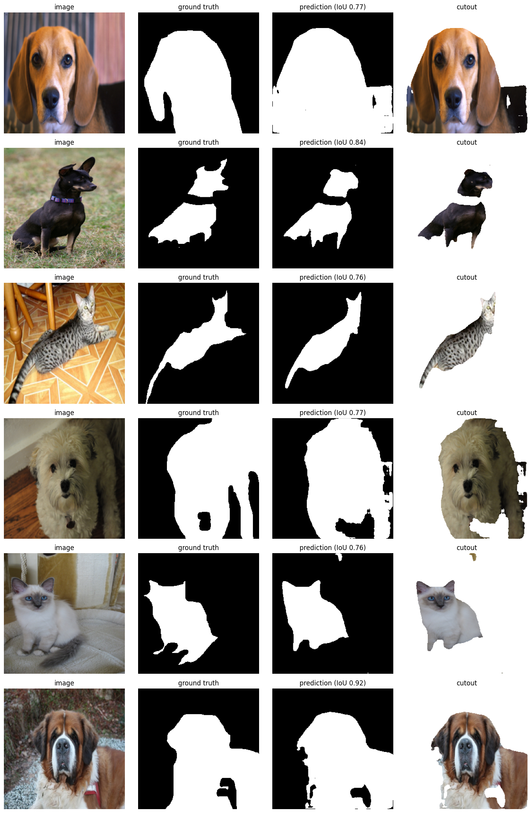
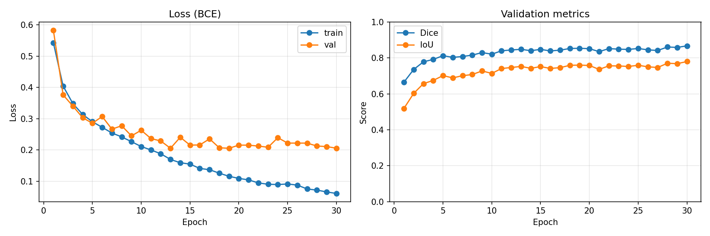
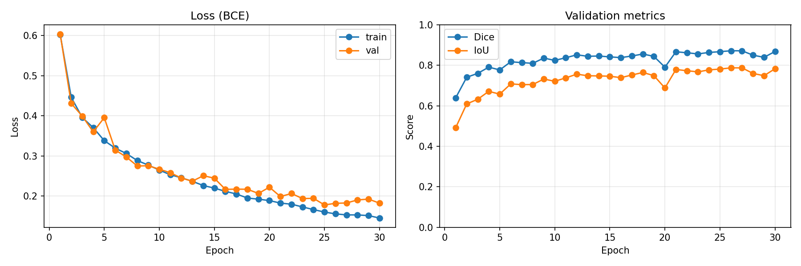
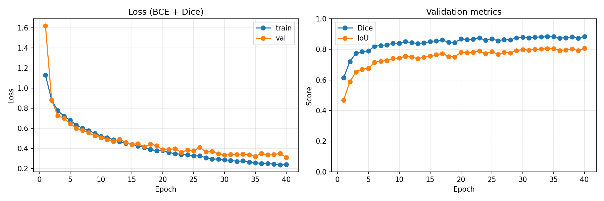

# Image Segmentation with U-Net

A clean, modular PyTorch implementation of **U-Net**, written from scratch and trained on the Oxford-IIIT Pet dataset to separate a cat or dog (foreground) from its background. The predicted mask can be used directly to cut the pet out of the image.

<p align="center">
  <br/>
  <em>Left to right: input image, ground truth, prediction, cutout (run 3).</em>
</p>

---

## Results

Validation set: 20% of the `trainval` split (736 images), fixed with seed 42.

| Run | Loss | Augmentation | Train loss | Val loss | Val Dice | Val IoU |
|---|---|---|---|---|---|---|
| v1 | BCE | No | ~0.06 | ~0.20 | - | - |
| v2 | BCE | Yes | - | ~0.18 | ~0.86 | ~0.78 |
| **v3 (current)** | **BCE + Dice** | **Yes** | **0.237** | **0.308** | **0.884** | **0.806** |

Notes:
- **v1** overfit badly: train loss kept dropping while validation loss got stuck.
- **v2** added data augmentation, which closed most of the train/val gap.
- **v3** added Dice loss on top of BCE. The final epoch (40) gives Dice 0.8844 and IoU 0.8063.
- Loss values of v1/v2 and v3 are **not comparable**, because BCE + Dice is on a different scale than BCE alone. Compare Dice and IoU instead.
- The best checkpoint is picked by validation loss, and the same validation set is used for these numbers, so they are slightly optimistic. A final evaluation on the official `test` split is still to do.

### Training curves

**Run 1: BCE, no augmentation** (overfits)

<p align="center">
  
</p>

**Run 2: BCE + augmentation**

<p align="center">
  
</p>

**Run 3: BCE + Dice + augmentation (40 epochs)**

<p align="center">
  
</p>

### Prediction examples
**Run 3**

<p align="center">
  
</p>

---

## How the model works

U-Net is an encoder-decoder network shaped like a "U".

- **Encoder (going down):** four blocks, each with two convolutions followed by a max-pool. Every block halves the image size and doubles the channels (64 → 128 → 256 → 512). The network learns *what* is in the image.
- **Bottleneck:** the deepest layer, with 1024 channels at 16×16 resolution.
- **Decoder (going up):** four blocks, each upsamples the features with a transposed convolution, then joins them with the matching encoder features and applies two convolutions. The network learns *where* things are.
- **Skip connections:** the encoder features are passed straight across to the decoder. This brings back fine spatial detail (like edges) that pooling would otherwise lose.
- **Output head:** a 1×1 convolution that turns 64 channels into 1 channel of raw logits, one per pixel. A sigmoid then turns them into foreground probabilities.

For a `[B, 3, 256, 256]` input, the output is `[B, 1, 256, 256]`.

---

## Loss and metrics

**Loss = BCE + Dice loss**

- **BCE** (`BCEWithLogitsLoss`) judges every pixel independently.
- **Dice loss** judges how well the predicted mask *overlaps* the true mask. It is computed per image on the sigmoid probabilities (no thresholding), so it stays differentiable:

  `DiceLoss = 1 - (2 * intersection) / (predicted area + true area)`

**Metrics (validation only)**

- **Dice score** and **IoU** are computed on the *thresholded* mask (probability > 0.5), per image, then averaged. Thresholding has no gradient, which is why these are used for evaluation and not for training.

---

## Dataset and training

- **Dataset:** Oxford-IIIT Pet (`torchvision.datasets.OxfordIIITPet`), `trainval` split.
- **Input size:** 256×256 (bilinear for images, nearest neighbour for masks).
- **Masks:** the original trimap (1 = pet, 2 = background, 3 = border) is converted to binary: pet = 1, everything else = 0.
- **Augmentation:** applied to the training set only (see `AugmentedDataset` in `dataset.py`).
- **Optimizer:** AdamW, learning rate 1e-4.
- **Batch size:** 16
- **Epochs:** 40
- **Split:** 80% train / 20% validation (seed 42).
- **Multi-environment support:** paths in `config.py` can be switched between Local, Google Colab and Kaggle.
- **Checkpointing:**
  - `last_checkpoint.pth`: full state, saved every epoch so training can resume after a crash.
  - `best_model.pth`: saved whenever validation loss improves.
  - `unet_pet_segmentation_final.pth`: weights only, saved at the end.

---

## Known issues, likely causes and possible fixes

The causes below are my best explanations based on the curves and the predictions. I have not tested each one yet, so treat them as hypotheses to check.

| Issue | Likely cause | Possible fix |
|---|---|---|
| **Holes inside the mask** (e.g. face or chest) | The model is trained from scratch on only ~2,900 images, so its sense of "what a whole pet looks like" is weak. Where fur is similar in colour or texture to the background (light fur on a light floor), it labels that part as background. | Pretrained encoder (better features); fill holes and keep the largest connected component as post-processing; train longer. |
| **Ragged or blurry edges around fur** | Fur edges are genuinely ambiguous (semi-transparent), the masks are binary and coarse, and the image is only 256×256. The border class is also treated as background, so labels near the edge are inconsistent. | Ignore the border class in the loss and metrics (or count it as foreground); use a higher resolution; use alpha matting as a later step for soft edges. |
| **Small stray blobs of background** | Pixels near the 0.5 threshold flip between pet and background. | Remove small connected components; tune the threshold on the validation set; stronger augmentation. |
| **Not fully converged** | Validation Dice and loss are still improving at epoch 40, and validation loss is noisy because the learning rate is constant. | More epochs and a learning rate scheduler (e.g. cosine). |
| **Small train/val gap** (0.237 vs 0.308) | Mild overfitting from a small training set. | Stronger augmentation, more data, or pretrained weights. |
| **Only works on cats and dogs** | The dataset contains nothing else, so the model never learned other objects. | Train on a more diverse dataset (e.g. a salient-object dataset like DUTS) with a pretrained encoder. |

Also still to do: evaluate on the official `test` split for an unbiased final number.

---

## Repository structure

```
├── config.py          # Paths (Local/Colab/Kaggle), checkpoint and training settings
├── dataset.py         # PetDataset, mask binarization, AugmentedDataset
├── double_conv.py     # Conv + BatchNorm + ReLU, twice
├── encoder.py         # Encoder block (DoubleConv + MaxPool)
├── decoder.py         # Decoder block (upsample + skip concat + DoubleConv)
├── model.py           # Full U-Net
├── losses.py          # DiceLoss (differentiable)
├── metrics.py         # Dice and IoU scores (thresholded)
├── train.py           # Training and validation loops, checkpointing, plots
├── predict.py         # Inference on a custom image or a dataset sample
├── requirements.txt
├── assets/            # Architecture diagram
├── results/           # Training curves and prediction examples for each run
└── README.md
```

---

## Quick start

```bash
# 1. Check the architecture and shapes
python model.py

# 2. Check the dataset loader
python dataset.py

# 3. Train (choose "bce" or "bce_dice" with LOSS_MODE in train.py)
python train.py

# 4. Predict on your own image
python predict.py --image path/to/cat_or_dog.jpg --output prediction.png

# 4b. Predict on a dataset sample (shows ground truth too)
python predict.py --sample_index 0 --output sample_prediction.png
```

---

## Reference

Ronneberger et al., [U-Net: Convolutional Networks for Biomedical Image Segmentation](https://arxiv.org/pdf/1505.04597) (2015).